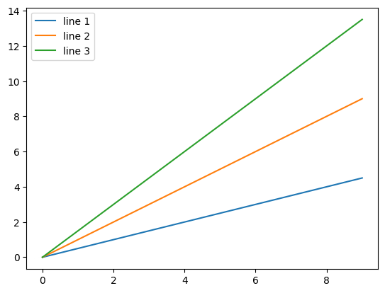
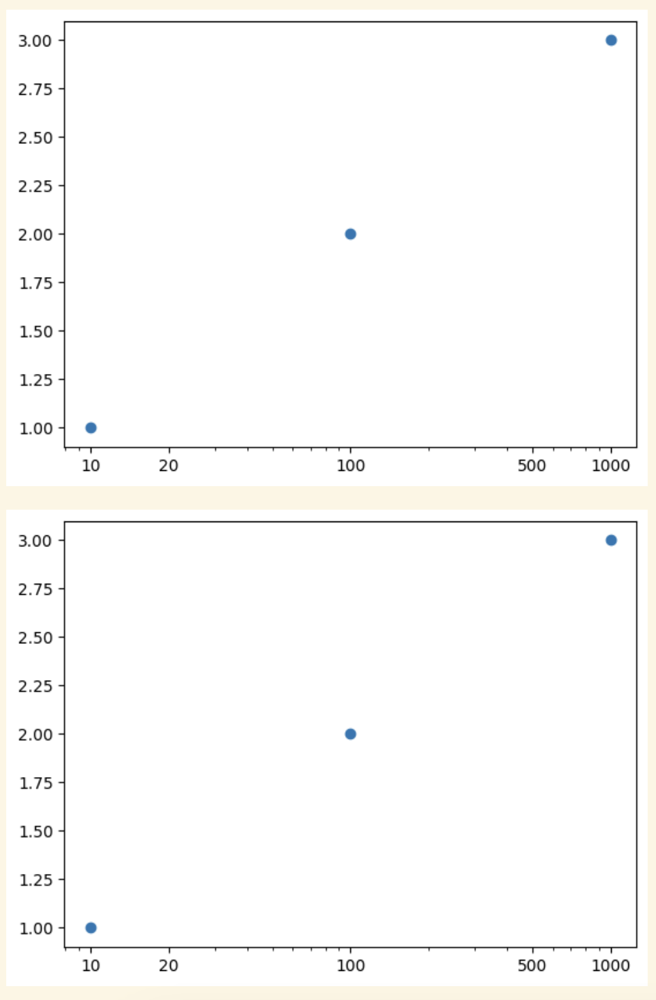

# matplotlib examples

## Legends
### `Axes.legend`
```python
import matplotlib.pyplot as plt
import numpy as np

_, ax = plt.subplots()
handles = []
for idx in range(1, 4):
    h, = ax.plot(np.arange(10), 0.5 * idx * np.arange(10), label=f"line {idx}")  # mind the `,` after `h`
    handles.append(h)
ax.legend(handles=handles)
plt.show()
```



## Scatter plots
### Scatter plot with points on a colour scale and a colour bar
```python
import matplotlib.pyplot as plt
import numpy as np

fig, ax = plt.subplots(1, 1)
x = np.random.rand(100)
y = np.random.rand(100)
colors = np.random.rand(100)
scatter = ax.scatter(x, y, c=colors, cmap='viridis')
colorbar = fig.colorbar(scatter, ax=ax)
colorbar.set_label("intensity")
plt.show()
```


## Manipulate axes
### Change axis scale (e.g. `log`) and add tick marks and labels
```python
import matplotlib.pyplot as plt
import matplotlib

fig1, ax1 = plt.subplots()
ax1.scatter([10, 100, 1000], [1, 2, 3])
ax1.set_xscale("log")
ax1.set_xticks([10, 20, 100, 500, 1000])  # Must appear after set_xscale(), otherwise 20 and 500 are not rendered properly
ax1.get_xaxis().set_major_formatter(matplotlib.ticker.ScalarFormatter())
plt.show()

plt.scatter([10, 100, 1000], [1, 2, 3])
plt.xscale("log")
plt.xticks([10, 20, 100, 500, 1000])  # Must appear after set_xscale(), otherwise 20 and 500 are not rendered properly
plt.gca().get_xaxis().set_major_formatter(matplotlib.ticker.ScalarFormatter())
plt.show()
```
{:style="height:600px"}